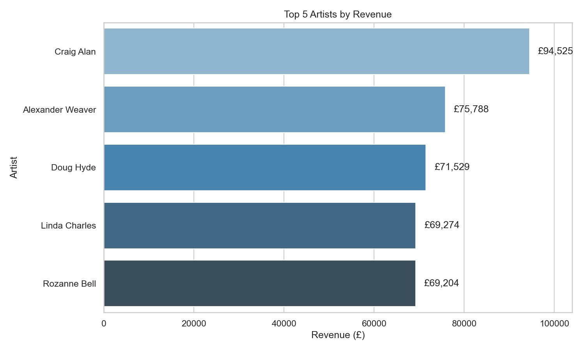
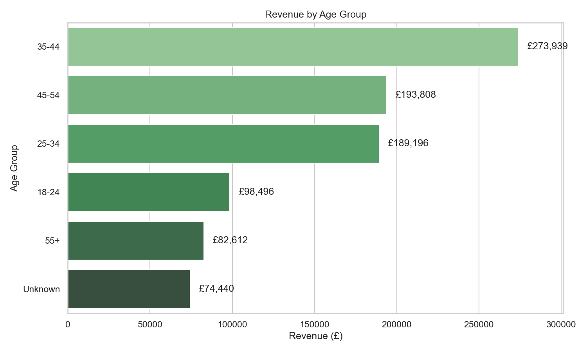
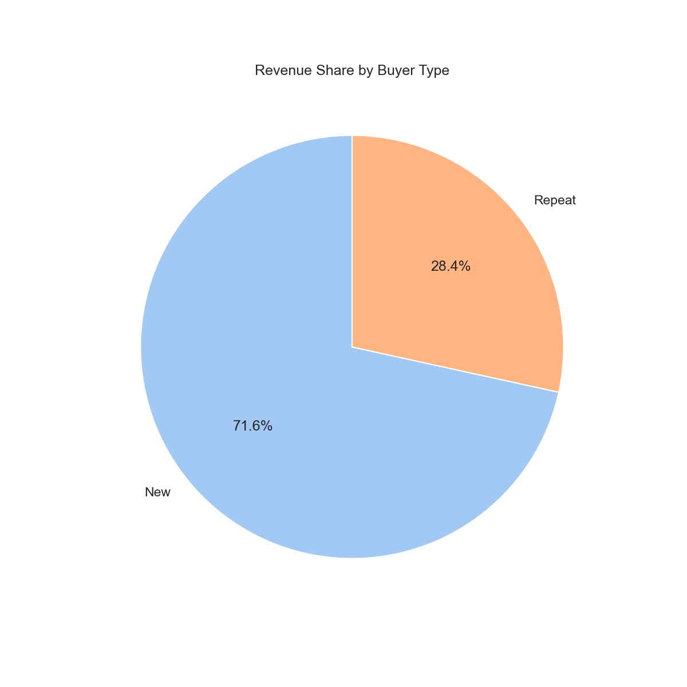
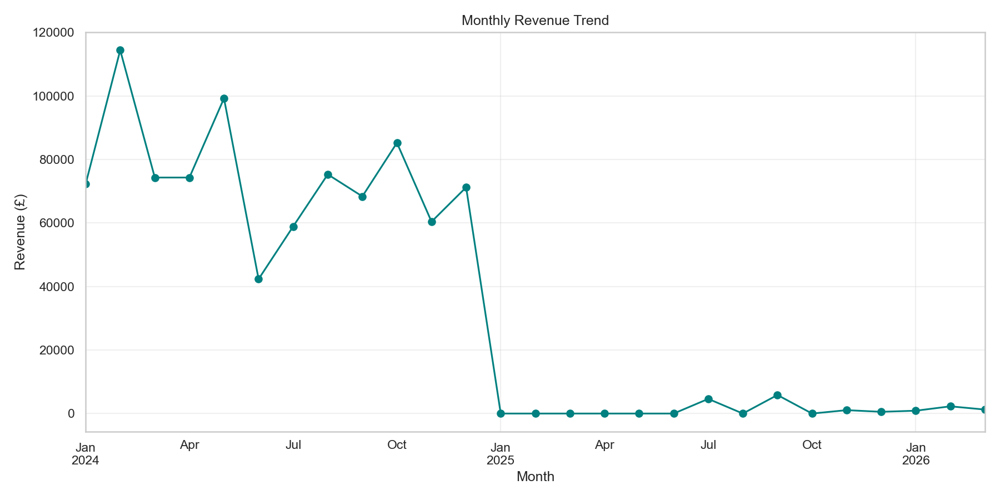

# Gallery Sales Data Cleaning Project

This project takes a dirty Python generated CSV export (`Dirty_Gallery_Sales_Data.csv`), which mimics an art gallery’s sales system and transforms it into a clean, consistent and reliable dataset suitable for reporting, dashboards, financial analysis and machine learning.
The end goal is to analyse the cleaned data to generate actionable insights and meaningful KPIs that support data driven business decisions.

## Tech Stack


## Project Pipeline
```
1 Dirty CSV (Python generated)
↓
Python – Data Generation
• Simulates realistic art gallery sales system (460 rows with intentional issues)
• Creates dirty data: duplicates, invalid prices, inconsistent formats, missing values
↓
SQLite – Profiling, Cleaning & Transformation
• Deduplication (window functions + ROW_NUMBER)
• Monetary value repair & recalculation (Total_GBP fixes)
• Date standardisation & validation
• Text normalisation & age group bucketing
• Output: 420 unique, high-quality transactions
↓
Cleaned Table
• Cleaned_Gallery_Sales_Data.csv (ready for analysis)
↓
Python – Advanced Analysis & Visualization (New Step)
• Re-imports cleaned CSV (using zero config file locator)
• Computes KPIs: Total Revenue, AOV, Repeat Rate, Return Rate
• Aggregations: Top 5 Artists by Revenue, Revenue by Age Group / Buyer Type / Artwork Type
• Payment method distribution
• Time-series: Monthly revenue trend
• Generates publication-ready plots (saved as PNG):
– Bar: Top 5 Artists by Revenue
– Pie: Revenue Share by Buyer Type
– Bar: Revenue by Age Group
– Line: Monthly Revenue Trend
↓
Insights & Business Recommendations
• £891K+ total revenue, £2,123 AOV, 32% repeat customers
• Artist concentration risks, age group targeting, loyalty program opportunities
• Visuals embedded in README for quick scanning
```
---

**Original data issues included:**
- Duplicate sale records (marked with `_dup` suffix)
- Inconsistent artist name spelling
- Mixed age group formats (e.g. "35 - 44", "45to54", "55 plus", "UNK")
- Missing or suspicious `Total_GBP` values
- Occasional invalid unit prices (`Price_GBP` ≤ 0)
- String inconsistencies (leading/trailing spaces)

**Goals achieved:**
- Single clean table: `Cleaned_Gallery_Sales_Data`
- 420 unique transactions (from original 460 rows)
- Unique `Sale_ID` primary key
- Full `YYYY-MM-DD` dates preserved
- Repaired monetary values
- Standardised categories

## Key Cleaning Steps Performed

- **Deduplication**  
  Removed logical duplicates by preferring non `_dup` versions (using window function + `rn = 1` filter)

- **Date Handling**  
  Ensured `SaleDate` is consistently stored as full `YYYY-MM-DD` text (explicit string validation & preservation)

- **Monetary Repairs**  
  - Recalculated `Total_GBP` when missing, empty, or suspiciously near zero  
  - Back-calculated `Price_GBP` when invalid (≤ 0 but money moved)  
  - Rounded consistently to 2 decimal places

- **Standardisation & Cleaning**  
  - Trimmed all text fields  
  - Light artist name fixes (e.g. "Andrei P" → "Andrei Protsouk")  
  - Simplified age group normalisation (35-44, 45-54, 55+, Unknown, etc.)  
  - Filtered out clearly invalid rows

- **Kept intentionally**  
  Negative quantities (real returns/refunds)  
  Future dates (2025–2026 entries appear valid in context)
  
## Insights and Meaningful KPIs Using the Cleaned Dataset

### Total Revenue
- £891,728.05  
  Represents total sales value across all transactions.

### Number of Transactions
- 420 transactions  
  Reflects total completed sales after data validation.

### Average Order Value (AOV)
- £2,123.16  
  The average value of each transaction, indicating strong high-value purchases.

### Customer Mix
- New: 286  
- Repeat: 134  
  68% New / 32% Repeat  
  Indicates strong acquisition performance with an opportunity to improve customer retention.

### Return Rate
- 1.9% of transactions  
  Low return rate suggests high customer satisfaction and strong product fit.

### Payment Method Distribution
- Credit Card: 74.5%  
- Cash: 16.9%  
- Bank Transfer: 8.6%  
  Digital payments dominate, supporting online and card-first sales strategies.

# Revenue Performance Insights

## Top 5 Artists by Revenue

1. Craig Alan £86,707.66  
2. Alexander Weaver £75,787.71  
3. Doug Hyde £73,308.67  
4. Rozanne Bell £68,620.41  
5. Jeff Rowland £64,500.11  

These five artists alone account for a substantial portion of the £891,728 total revenue (approximately 40–45% based on the figures), demonstrating a classic Pareto (80/20) effect common in the art market. Recent 2025 reports (Art Basel & UBS Global Art Market Report) highlight similar concentration: top-tier artists and high-end works drive disproportionate sales, while mid-tier and emerging artists often struggle amid economic recalibration.
This dependency creates both opportunity (leveraging star power for brand visibility) and risk (vulnerability if key artists reduce output, shift galleries, or face market saturation).
Recommendation: Diversify artist promotion and allocate marketing budget to mid-tier performers (e.g., via targeted social campaigns or collaborations) to build a more balanced portfolio and mitigate single-artist risk, aligning with 2025–2026 trends toward emerging and undervalued artists gaining traction among younger collectors.

## Revenue by Age Group 

- 35–44 £273,938.54  
- 25–34 £193,058.80  
- 45–54 £176,827.02  
- 18–24 £99,054.06  
- 55+ £82,612.21  

Buyers aged 25–44 (millennials and older Gen Z) generate over 50% of revenue, confirming them as the gallery's core demographic. This mirrors global 2025 collector surveys (Art Basel & UBS): millennials and Gen Z now represent 70–75% of active high-net-worth collectors, with higher allocation to art (up to 26% of wealth for Gen Z) and broader tastes (emerging, digital, and affordable works). Younger buyers prioritize emotional resonance, accessibility, and lifestyle alignment over traditional prestige pieces.
Recommendation: Tailor marketing and exhibitions toward 25–44-year-olds — emphasize social media (Instagram/TikTok), online previews, limited-edition prints, and experiential events (e.g., artist talks, pop-ups). This aligns with 2025–2026 shifts: digital-native collectors drive demand for accessible art, while older segments (55+) remain steady but lower-volume

## Revenue by Buyer Type 


New customers dominate (68% of transactions), while repeat buyers (32%) contribute disproportionately to revenue due to higher average spend and loyalty. Industry benchmarks show repeat customers often generate 3× more lifetime value than first-timers, yet galleries frequently allocate 80%+ of effort to acquisition over retention.
Recommendation: Implement targeted retention tactics — loyalty discounts, exclusive previews, personalized follow-ups, or a simple CRM/tracking system for past buyers. Increasing repeat rate by even 5–10% could significantly boost profitability, especially as new-buyer acquisition costs rise in a competitive 2026 market.

## Monthly Revenue Trend  


Revenue shows clear seasonality and variability, with peaks likely tied to exhibitions, holidays, pay cycles, or seasonal buying patterns (e.g., end-of-year gifting, spring/summer events). Art market data indicates typical seasonality: stronger Q4 (holiday/art fair season) and Q1/Q2 (post-tax, spring fairs), with summer slowdowns — patterns that hold in gallery and online sales.
Recommendation: Plan inventory and promotions around observed peaks (e.g., boost marketing in high-revenue months). Use this trendline for forecasting — identify anomalies (e.g., dips) to investigate external factors (economic news, gallery events) and smooth revenue through consistent online engagement or off-peak incentives.

## Key Business Insights 
**1. Strong Revenue Performance**

With nearly £900k in sales, the gallery demonstrates strong commercial viability.
The high average order value indicates customers are willing to invest in premium artwork.

**2. Acquisition vs Retention Opportunity**

Although new customers dominate (68%), only 32% return.
This highlights opportunities for:
- Loyalty programmes
- VIP previews
- Repeat-buyer incentives

**3. Revenue Concentration Risk**

Top artists generate a disproportionate share of revenue.
While beneficial, this creates dependency risk if key artists leave.
- Recommendation: Diversify promotion across mid-performing artists.

**4. Digitally-Driven Sales**

Over 74% of payments use credit cards, confirming:
- Strong digital readiness
- Potential for online expansion
- Low reliance on cash

**5. High Customer Satisfaction**

The low return rate (1.9%) indicates:
- Accurate product descriptions
- Strong buyer satisfaction
- Good pricing alignment

**6. Clearly Defined Core Customer Segment**
Buyers aged between 25–44 drive the most revenue.
Marketing Implication:
- Focus exhibitions, social media campaigns, and advertising toward this demographic.

## Recommended KPIs for Ongoing Monitoring

This dataset supports long term business tracking using the following KPIs:
- Total Revenue	Overall financial performance
- Average Order Value	Customer spending behaviour
- Repeat Purchase Rate	Retention strength
- Artist Revenue Share	Portfolio balance
- Return Rate	Product satisfaction
- Revenue by Age Group	Market segmentation
- Payment Mix	Transaction preferences

## Files in this Repository

| File                                   | Description                                      |
|----------------------------------------|--------------------------------------------------|
| `Dirty_Gallery_Sales_Data.csv`         | Original dirty generated file                    |
| `Cleaned_Gallery_Sales_Data.csv`       | Cleaned table                                    |
| `Clean_Gallery_Sales_Data.sql`         | Full SQL script to create the clean table        |
| `Generate_Dirty_Gallery_Sales_Data.py` | Full Python script to gennerate the dirty file   |
| `README.md`                            | Current file                                     |

## How to Use

1. Load the original dirty CSV into your database as table `Dirty_Gallery_Sales_Data.csv`  
   (SQLite, PostgreSQL, MySQL, DuckDB, etc.)

2. Run the cleaning script:
   ```bash
   sqlite3 gallery.db < Clean_Gallery_Sales_Data.sql
